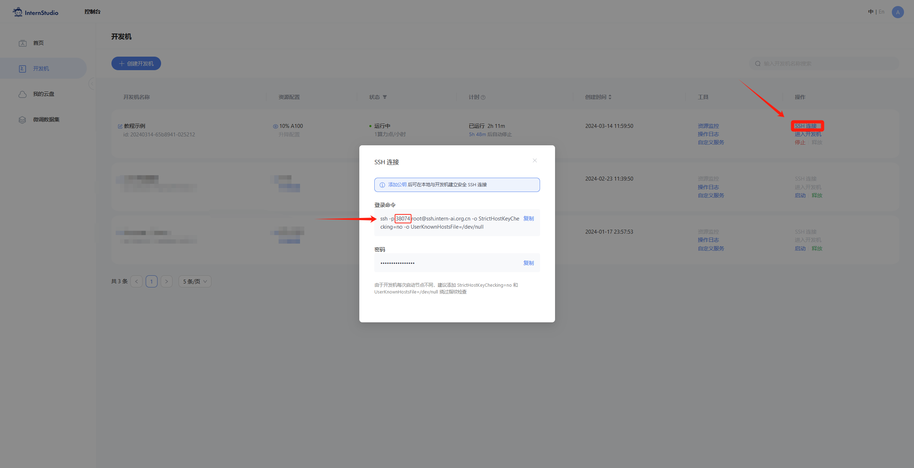
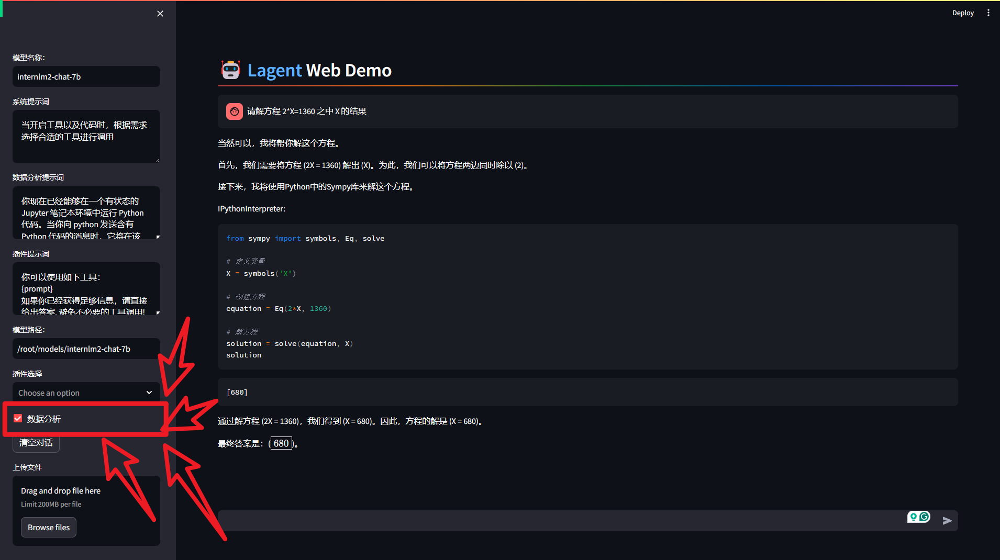

# 大模型Demo扩展部分
##  4 **实战：使用 `Lagent` 运行 `InternLM2-Chat-7B` 模型（开启 30% A100 ）**

### 4.1 **初步介绍 Lagent 相关知识**
Lagent 是一个轻量级、开源的基于大语言模型的智能体（agent）框架，支持用户快速地将一个大语言模型转变为多种类型的智能体，并提供了一些典型工具为大语言模型赋能。它的整个框架图如下:


Lagent 的特性总结如下：
- 流式输出：提供 stream_chat 接口作流式输出，本地就能演示酷炫的流式 Demo。
- 接口统一，设计全面升级，提升拓展性，包括：  
    - Model : 不论是 OpenAI API, Transformers 还是推理加速框架 LMDeploy 一网打尽，模型切换可以游刃有余；         
    - Action: 简单的继承和装饰，即可打造自己个人的工具集，不论 InternLM 还是 GPT 均可适配；        
    - Agent：与 Model 的输入接口保持一致，模型到智能体的蜕变只需一步，便捷各种 agent 的探索实现；  
- 文档全面升级，API 文档全覆盖。

### 4.2 **配置基础环境**

打开 `Intern Studio` 界面，调节配置（必须在开发机关闭的条件下进行）：


重新开启开发机，输入命令，开启 conda 环境：

```bash
conda activate demo
```

打开文件子路径

```bash
cd /root/demo
```

使用 git 命令下载 Lagent 相关的代码库：

```bash
git clone https://gitee.com/internlm/lagent.git
# git clone https://github.com/internlm/lagent.git
cd /root/demo/lagent
git checkout 581d9fb8987a5d9b72bb9ebd37a95efd47d479ac
pip install -e . # 源码安装
```

运行效果如图：


### 4.3 **使用 `Lagent` 运行 `InternLM2-Chat-7B` 模型为内核的智能体**

`Intern Studio` 在 share 文件中预留了实践章节所需要的所有基础模型，包括 `InternLM2-Chat-7b` 、`InternLM2-Chat-1.8b` 等等。我们可以在后期任务中使用 `share` 文档中包含的资源，但是在本章节，为了能让大家了解各类平台使用方法，还是推荐同学们按照提示步骤进行实验。


打开 lagent 路径：

```bash
cd /root/demo/lagent
```

在 terminal 中输入指令，构造软链接快捷访问方式：

```bash
ln -s /root/share/new_models/Shanghai_AI_Laboratory/internlm2-chat-7b /root/models/internlm2-chat-7b
```

打开 `lagent` 路径下 `examples/internlm2_agent_web_demo_hf.py` 文件，并修改对应位置 (71行左右) 代码：


```bash
# 其他代码...
value='/root/models/internlm2-chat-7b'
# 其他代码...
```

输入运行命令 - **点开 6006 链接后，大约需要 5 分钟完成模型加载：**

```bash
streamlit run /root/demo/lagent/examples/internlm2_agent_web_demo_hf.py --server.address 127.0.0.1 --server.port 6006
```

待程序运行的同时，对本地端口环境配置本地 `PowerShell` 。使用快捷键组合 `Windows + R`（Windows 即开始菜单键）打开指令界面，并输入命令，按下回车键。（Mac 用户打开终端即可）


打开 PowerShell 后，先查询端口，再根据端口键入命令 （例如图中端口示例为 38374）：



```bash
# 从本地使用 ssh 连接 studio 端口
# 将下方端口号 38374 替换成自己的端口号
ssh -CNg -L 6006:127.0.0.1:6006 root@ssh.intern-ai.org.cn -p 38374
```

再复制下方的密码，输入到 `password` 中，直接回车：


最终保持在如下效果即可：


打开 [http://127.0.0.1:6006](http://127.0.0.1:6006) 后，（会有较长的加载时间）勾上数据分析，其他的选项不要选择，进行计算方面的 Demo 对话，即完成本章节实战。键入内容示例：

    请解方程 2*X=1360 之中 X 的结果



##  **下面得内容供学有余力得同学练习**

## 5 **实战：实践部署 `浦语·灵笔2` 模型（开启 50% A100）**

### 5.1 **初步介绍 `XComposer2` 相关知识**
`浦语·灵笔2` 是基于 `书生·浦语2` 大语言模型研发的突破性的图文多模态大模型，具有非凡的图文写作和图像理解能力，在多种应用场景表现出色，总结起来其具有：
- 自由指令输入的图文写作能力： `浦语·灵笔2` 可以理解自由形式的图文指令输入，包括大纲、文章细节要求、参考图片等，为用户打造图文并貌的专属文章。生成的文章文采斐然，图文相得益彰，提供沉浸式的阅读体验。
- 准确的图文问题解答能力：`浦语·灵笔2` 具有海量图文知识，可以准确的回复各种图文问答难题，在识别、感知、细节描述、视觉推理等能力上表现惊人。
- 杰出的综合能力： `浦语·灵笔2-7B` 基于 `书生·浦语2-7B` 模型，在13项多模态评测中大幅领先同量级多模态模型，在其中6项评测中超过 `GPT-4V` 和 `Gemini Pro`。


### 5.2 **配置基础环境**

选用 `50% A100` 进行开发：


进入开发机，启动 `conda` 环境：

```bash
conda activate demo
# 补充环境包
pip install timm==0.4.12 sentencepiece==0.1.99 markdown2==2.4.10 xlsxwriter==3.1.2 gradio==4.13.0 modelscope==1.9.5
```

下载 **InternLM-XComposer 仓库** 相关的代码资源：

```bash
cd /root/demo
git clone https://gitee.com/internlm/InternLM-XComposer.git
# git clone https://github.com/internlm/InternLM-XComposer.git
cd /root/demo/InternLM-XComposer
git checkout f31220eddca2cf6246ee2ddf8e375a40457ff626
```

在 `terminal` 中输入指令，构造软链接快捷访问方式：

```bash
ln -s /root/share/new_models/Shanghai_AI_Laboratory/internlm-xcomposer2-7b /root/models/internlm-xcomposer2-7b
ln -s /root/share/new_models/Shanghai_AI_Laboratory/internlm-xcomposer2-vl-7b /root/models/internlm-xcomposer2-vl-7b
```

### 5.3 **图文写作实战**

继续输入指令，用于启动 `InternLM-XComposer`：

```bash
cd /root/demo/InternLM-XComposer
python /root/demo/InternLM-XComposer/examples/gradio_demo_composition.py  \
--code_path /root/models/internlm-xcomposer2-7b \
--private \
--num_gpus 1 \
--port 6006
```

待程序运行的同时，参考章节 3.3 部分对端口环境配置本地 `PowerShell` 。使用快捷键组合 `Windows + R`（Windows 即开始菜单键）打开指令界面，（Mac 用户打开终端即可）并输入命令，按下回车键：


打开 PowerShell 后，先查询端口，再根据端口键入命令 （例如图中端口示例为 38374）：


```bash
# 从本地使用 ssh 连接 studio 端口
# 将下方端口号 38374 替换成自己的端口号
ssh -CNg -L 6006:127.0.0.1:6006 root@ssh.intern-ai.org.cn -p 38374
```

再复制下方的密码，输入到 `password` 中，直接回车：


最终保持在如下效果即可：


打开 [http://127.0.0.1:6006](http://127.0.0.1:6006) 实践效果如下图所示：


### 5.4 **图片理解实战**

根据附录 6.4 的方法，关闭并重新启动一个新的 `terminal`，继续输入指令，启动 `InternLM-XComposer2-vl`：

```bash
conda activate demo

cd /root/demo/InternLM-XComposer
python /root/demo/InternLM-XComposer/examples/gradio_demo_chat.py  \
--code_path /root/models/internlm-xcomposer2-vl-7b \
--private \
--num_gpus 1 \
--port 6006
```

打开 [http://127.0.0.1:6006](http://127.0.0.1:6006) (上传图片后) 键入内容示例如下：

    请分析一下图中内容

实践效果如下图所示：


## 6 **附录**

### 6.1 **（可选参考）介绍 `pip` 换源及 `conda` 换源方法**
对于 `pip `换源，需要临时使用镜像源安装，如下所示：some-package 为你需要安装的包名

```bash
pip install -i https://mirrors.cernet.edu.cn/pypi/web/simple some-package
```

设置 `pip` 默认镜像源，升级 `pip` 到最新的版本 (>=10.0.0) 后进行配置，如下所示：

```bash
python -m pip install --upgrade pip
pip config set global.index-url   https://mirrors.cernet.edu.cn/pypi/web/simple
```

如果您的 `pip` 默认源的网络连接较差，可以临时使用镜像源升级 `pip`：

```bash
python -m pip install -i https://mirrors.cernet.edu.cn/pypi/web/simple --upgrade pip
```

对于 `conda` 换源，镜像站提供了 `Anaconda` 仓库与第三方源（`conda-forge`、`msys2`、`pytorch` 等），各系统都可以通过修改用户目录下的 `.condarc` 文件来使用镜像站。不同系统下的 `.condarc` 目录如下：

- Linux: `${HOME}/.condarc`
- macOS: `${HOME}/.condarc`
- Windows: `C:\Users\<YourUserName>\.condarc`

注意：
- Windows 用户无法直接创建名为 `.condarc` 的文件，可先执行 `conda config --set show_channel_urls yes` 生成该文件之后再修改。

快速配置

```shell
cat <<'EOF' > ~/.condarc
channels:
- defaults
show_channel_urls: true
default_channels:
- https://mirrors.tuna.tsinghua.edu.cn/anaconda/pkgs/main
- https://mirrors.tuna.tsinghua.edu.cn/anaconda/pkgs/r
- https://mirrors.tuna.tsinghua.edu.cn/anaconda/pkgs/msys2
custom_channels:
conda-forge: https://mirrors.tuna.tsinghua.edu.cn/anaconda/cloud
pytorch: https://mirrors.tuna.tsinghua.edu.cn/anaconda/cloud
EOF
```
